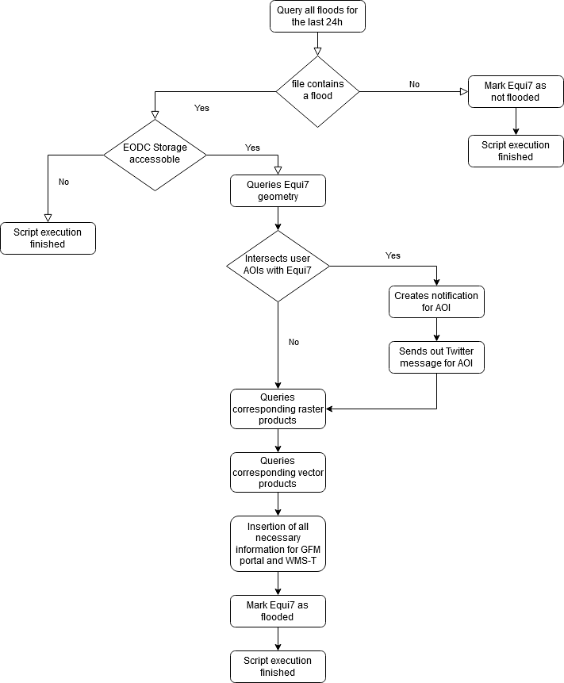

================
Pronósticos
================

Sobre la plataforma se pueden consultar los siguientes datos de pronósticos:

  - modelos meteorológicos
  - modelos de incendios
  - modelos hidrológicos
  - modelos hidráulicos

    
    Pagina de los Pronósticos

***************************
Modelos meteorológicos
***************************

Los modelos de Pronóstico Meteorológico predicción numérica son modelos matemáticos de la atmósfera que utilizan las condiciones meteorológicas actuales como inicialización de las ecuaciones fundamentales del modelo para la predicción meteorológica del tiempo en el futuro. Se trata de modelos numéricos porqué la solución se logra a través de técnicas de análisis numéricos y el uso de elevada capacidad de calculo, como la no linealidad de las ecuaciones del atmósfera involucradas no permite una solución analítica.

En la sección modelos meteorológicos se pueden encontrar:

- GFS 0.25 Sudamerica
- GFS 0.5
- ETA 15 km
- CPTEC-WRF
- WRF 10 km
- WRF DA (Asimilación de datos)

Para todos los modelos al hacer clic sobre el nombre de la capa, es posible abrir un menú donde las propiedades de la capa pueden ser analizadas y seleccionadas. Es posible seleccionar:

 - Fecha (cambiando el intervalo de tiempo de previsión de referencia); en el menú, es posible seleccionar el pronóstico progresivo de la variable seleccionada. 

 - Variable: selección de la variable meteorológica de interés entre: lluvia total, temperatura, presión, humedad relativa, altura de geopotencial, viento.

 - Posibilidad de Agregación Temporal (solo  lluvia). En este menú desplegable, es posible seleccionar el intervalo de tiempo que se utilizará para evaluar la precipitación acumulada (que sólo está disponible para la variable Lluvia Total). Cambiar el intervalo de acumulación significa variar el intervalo de tiempo en el que se quiere evaluar la precipitación.
   Por ejemplo, si se selecciona la fecha "Run:.. 24/04/2016 0000 Prog. 24" y como rango acumulativo "Ultimas 12 h", la capa visualizada representará la previsión en el instante "Run + 24 h" que muestra la lluvia total acumulada evaluada en el intervalo entre el 23/04/2016 a las 12:00 y el 24/04/2016 a las 00:00.
   Se permite al usuario cargar y mostrar alturas de precipitación acumulada durante los siguientes períodos: ultimas 3h, ultimas 6h, ultimas 12h, ultimas 24h, ultimas 48h, ultimas 72h.

 - Modalidad de agregación del dato (solo por lluvia);
   El dato de lluvia acumulada puede ser agregado a nivel espacial, en respecto a las siguientes capas físico-administrativas: nativa; departamentos; provincias; municipios; cuencas generales (Amazonas, Altiplano, Plata); cuencas principales; subcuencas principales; cuencas modeladas (Beni, Chapare, San Juan del Oro).

**GFS**

GFS significa Global Forecast System y representa un modelo matemático de circulación global, desarrollado por la NOAA (National Oceanic and Atmospheric Administration), para proporcionar pronósticos a nivel global. Hay diferentes niveles de detalle del pronóstico sea como resolución sea como capacidad de describir los fenómenos atmosféricos. En la plataforma están presentes los modelos con resolución espacial de la malla de 0.5 grados y 0.25 grados.
Cada día hay un pronóstico de +3 a + 180 horas con un intervalo de tiempo de 3 horas.

.. figure:: img/img_GFS025_dewBOL.png
    :height: 400px
    :width: 800px
    :scale: 50 %
    :alt: Dewetra Bolivia ejemplo GFS 0.25
    :align: center
    
    Ejemplo GFS 0.25

**CPTEC-WRF**

El WRF 5x5 km desarrollado por el Centro de Previsão de Tempo e Estudos Climáticos (Brasil). 

.. figure:: img/img_CPTECWRF_dewBOL.png
    :height: 400px
    :width: 800px
    :scale: 50 %
    :alt: Dewetra Bolivia ejemplo CPTEC-WRF
    :align: center
    
    ejemplo CPTEC-WRF

**WRF**

Dado que los modelos de riesgo relacionados con las condiciones atmosféricas necesariamente depender de una previsión meteorológica relativamente precisa, se estableció la prioridad en la mejora de la predicción meteorológica numérica. 

Por esto se ha implementado un modelo de área limitada con el fin de establecer un servicio operativo capaz de proporcionar 72h de pronósticos meteorológicos a nivel diario. El modelo elegido para realizar esta tarea es el “Weather Research and Forecasting” (WRF): un sistema, con código abierto, de predicción numérica del tiempo a la mesoescala diseñado para servir al pronóstico operativo y a las necesidades de investigación atmosférica. El modelo Advanced Research Weather Research and Forecasting (ARW-WRF) es un modelo totalmente comprensible, 3D, euleriano, no hidrostático y conservador para las variables escalares.

WRF puede ser utilizado ya sea directamente (para pronosticar lluvias intensas, granizo, heladas, calor y olas de frío, las ráfagas de viento y visualizarlas dentro de la plataforma Dewetra) o indirectamente (como entrada para los modelos de riesgo específicos para pronosticar inundaciones, deslizamientos de tierra, incendios, etc.).

El WRF permite mejorar la predicción de eventos peligrosos, facilitando los administradores de desastres en las decisiones preventivas y en la toma de medidas de protección hacia la población, los cultivos y el ganado.

El WRF, con un pronóstico de 72 horas, sale al rededor de las 9 por la mañana y tiene una resolución fina, de 10 km, que permite pronosticar con buena escala la distribución y la intensidad de la lluvia.
El modelo cuenta también con un modulo de asimilación de datos (WRF-DA) que permite corregir el punto de empiezo del pronóstico a la mesoescala WRF con las observaciones reales medidas directamente al suelo o por sensores de tele-medición.

.. figure:: img/img_WRF10_dewBOL.png
    :height: 400px
    :width: 800px
    :scale: 50 %
    :alt: Dewetra Bolivia ejemplo WRF 10 Km
    :align: center
    
    ejemplo WRF 10 Km

***************************
Modelos de incendios
***************************

En la sección modelos de incendio se pueden consultar las salidas del modelo de pronóstico de incendios forestales RISICO. Ese modelo utiliza informaciónes estaticas como la vegetación y salidas de los modelos de pronósticos meteorológicos (WRF, CPTEC-WRF) como humedad relativa y viento para pronosticar donde se pueden tener las condiciones mas favorables para el desarrollo de un incendio.
Las salidas del modelo RISICO son las siguientes:

 - Velocidad de propagación (ROS) [m/h]
 - Intensidad de la linea de fuego [kW/m]
 - Humedad de combustible fino [-]
 - Multiplicador del efecto de viento [-]
 - Indice meteo de fuego [-]

.. figure:: img/img_RISICO_dewBOL.png
    :height: 400px
    :width: 800px
    :scale: 50 %
    :alt: Velocidad de propagación RISICO
    :align: center
    
    Salida RISICO Velocidad de propagación

El modelo cuenta también con un módulo de agregación de datos a nivel espacial por: departamentos, provincias, municipios y áreas protegidas nacionales. Descripción detallada de la implementación del RISICO configurada en Bolivia se puede encontrar al siguiente enlace:

  - :download:`Manual del RISICO Bolivia <mat/RISICO_Bolivia_manual.pdf>`.

***************************
Modelos hidrológicos
***************************

En la sección de modelos hidrológicos están disponibles modelos locales que permiten acceso a las secciones hidrológicas, proporcionando en cada una, simulaciones deterministas y probabilísticas de los caudales según la previsión meteorológica del modelo WRF o los datos observados GSMAP. Además, se encuentran algunas salidas de modelos de pronósticos hidrológicos utilizados a nivel global (GLOFAS). Los modelos presentes son:

 - Flood-PROOFS Deterministico (WRF)
 - Flood-PROOFS Probabilistico (WRF)
 - Flood-PROOFS Observado (GSMAP)
 - Flood-PROOFS Deterministico (WRF DA, bajo solicitud)
 - GLOFAS, puntos de informe 
 - GLOFAS Tr=20 y Tr=5

**Flood-PROOFS Bolivia**

Flood-PROOFS (Flood-PRObabilistic Operational Forecasting System) es un sistema diseñado para el pronóstico operativo de las crecidas y de las inundaciones. Suporta los tomadores de decisiones a lo largo de la fase de previsión y proporciona una evaluación cuantitativa de los efectos en términos de caudal y de flujo máximo de un río.
El pronóstico se lleva a cabo tanto de manera determinista como de manera probabilística. Se toman en cuenta sea los pronóstico de precipitación meteorológica sea la imprevisibilidad de los patrones de precipitación a pequeñas escalas espacio-temporales.
Flood-PROOFS proporciona el pronóstico hidrológico de detalle en tres cuencas:

  - Cuenca del Chapare (Cochabamba);
  - Cuenca del Rio Beni (La Paz, Cochabamba, Beni)
  - Cuenca del San Juan del Oro (Potosí, Chuquisaca, Tarija)

Flood-PROOFS gestiona los datos de ingreso y gestiona el flujo de trabajo del sistema necesario para el pronóstico hidro-meteorológico: modelos meteorológicos, datos en tiempo real de las estaciones meteorológicas, datos en tiempo real del funcionamiento de la regulación de las estructuras hidráulicas y datos de satélite se consideran en este proceso. Al final el sistema proporciona una evaluación cuantitativa del caudal y de los picos de crecida y evalúa la probabilidad de exceder los umbrales críticos en todas las secciones hidrométricas de las cuencas que se necesiten. El modelo hidrológico implementado (CONTINUUM) es a código abierto, escrito en Fortran.

Al cargar los modelos se pueden visualizar las secciones hidrométricas de las cuencas modeladas.

.. figure:: img/img_secciones_dewBOL.png
    :height: 400px
    :width: 800px
    :scale: 50 %
    :alt: Dewetra Bolivia secciones cuencas modeladas
    :align: center
    
    Secciones hidrométricas cuencas modeladas en Bolivia

Haciendo el click sobre la sección que se quiere consultar se puede visualizar el grafico de caudal pronosticado y observado por la sección entre la fecha de inicio y la fecha de fin seleccionadas como periodo de análisis. 
Dicha imagen y los datos respectivos se pueden también descargar en el escritorio a través del pulsante en alto a la derecha.

.. figure:: img/img_serie_caudal_dewBOL.png
    :height: 400px
    :width: 800px
    :scale: 50 %
    :alt: Dewetra Bolivia Datos de caudal secciones modelos hidrológicos
    :align: center
    
    Ejemplo de dato de caudal probabilistico sección modelo hidro

 
**Productos GLOFAS**

GloFAS, desarrollado conjuntamente por la Comisión Europea y el Centro Europeo para Pronósticos Meteorológicos a Mediano Alcance (ECMWF), es un sistema global de pronóstico y monitoreo hidrológico independiente de los límites administrativos y políticos.

Los puntos de informe son puntos donde hay más información de pronóstico disponible. Los puntos púrpura / rojo / amarillo denotan una probabilidad pronosticada de exceder un período de retorno de 20 años (púrpura) / 5 años (rojo) / 2 años (amarillo)> 20%. 

Los números denotan el porcentaje de miembros del conjunto que excede el período de retorno específico. La forma denota la tendencia ascendente (triángulo ascendente), decreciente (triángulo descendente) o estancada (círculo) de la descarga media del conjunto dentro del horizonte de pronóstico. Los cuadrados grises representan puntos de notificación sin pronósticos que excedan los niveles de retorno de 2 años.

Los productos GLOFAS Tr=20 y Tr=5 representan la red hidrográfica donde se pronostica un caudal con excedencia de periodo de retorno de 5 o 20 años.

.. figure:: img/img_GLOFASred_dewBOL.png
    :height: 400px
    :width: 800px
    :scale: 50 %
    :alt: Producto GLOFAS Tr=20 
    :align: center
    
    Producto GLOFAS Tr=20

Para mas informaciones:

 `https://www.globalfloods.eu/ <https://www.globalfloods.eu/>`_

***************************
Modelos hidráulicos
***************************

En la sección modelos hidráulicos se pueden consultar las salidas del modelo de pronóstico   TELEMAC-2D que permite la estimación de las áreas de posible inundación según los caudales pronosticados por el modelo hidrológico CONTINUUM.TELEMAC-2D es un software de código abierto de amplio utilizo y puede funcionar directamente en serie con el modelo hidrológico o, según la tipología de elaboración necesaria, a través de una serie de mapas estáticas generadas para diferentes niveles de caudal en ingreso.
Este modelo hidráulico está actualmente en función para la cadena de pronostico en el Beni   (Rurrenabaque) y en el Chapare (Villa Tunari).
Las salidas del modelo TELEMAC-2D son las siguientes:

 - Profundidad del agua
 - Zonas de amenaza
 - Velocidad

.. figure:: img/img_TELEMAC_dewBOL.png
    :height: 400px
    :width: 800px
    :scale: 50 %
    :alt: Profundidad del agua TELEMAC
    :align: center
    
    Salida TELEMAC Profundidad del agua
